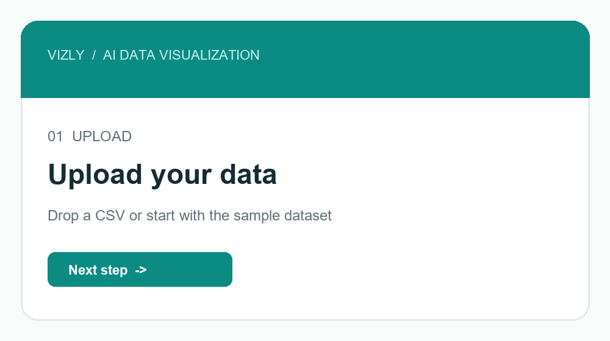

# Vizly — AI Data Visualization

Turn a CSV into a clear data story. Vizly is a Streamlit app that interprets
natural-language questions and generates useful analyses and visualizations
with Together AI and E2B.

> Upload your data. Ask a question. Discover the story.

## Topics

`python` `streamlit` `data-visualization` `data-analysis` `generative-ai`
`llm` `pandas` `together-ai` `e2b` `ai-agent`

## Why Vizly?

Vizly helps people explore unfamiliar datasets without writing analysis code.
It combines instant local profiling with AI-generated explanations and charts,
so users can understand the shape of their data before asking deeper questions.

## Features

- Upload and preview CSV datasets
- View rows, columns, numeric fields, missing values, duplicates, and unique values
- Profile every column by type, completeness, and cardinality
- Generate instant trend, area, and grouped bar charts
- Ask natural-language questions about the dataset
- Generate AI explanations and visualizations with Together AI and E2B
- Use a clean, responsive Streamlit dashboard

## Project showcase

Visit the GitHub Pages landing page:
**https://charan-hari.github.io/Data-Visualitzation-AI/**

GitHub Pages hosts the project showcase. The interactive AI dashboard runs
locally or on Streamlit Community Cloud because GitHub Pages cannot execute
Python or Streamlit applications.

## Demo

Add your screen recording here as `docs/assets/vizly-demo.gif`:

```markdown

```

Recommended GIF flow:

1. Upload a CSV.
2. Show the dataset metrics and quick chart.
3. Enter a natural-language question.
4. Show the AI interpretation and generated visualization.

## Screenshots

Add screenshots under `docs/assets/` and display them like this:

```markdown


```

Keep screenshots cropped to the app window and avoid including API keys.

## How to Run

Follow the steps below to set up and run the application:
- Before anything else, Please get a free Together AI API Key here: https://api.together.ai/signin
- Get a free E2B API Key here: https://e2b.dev/ ; https://e2b.dev/docs/legacy/getting-started/api-key

1. **Clone the repository**
   ```bash
   git clone https://github.com/Charan-Hari/Data-Visualitzation-AI.git 
   cd Data-Visualitzation-AI
   ```
2. **Install the dependencies**
    ```bash
    pip install -r requirements.txt
    ```
3. **Run the Streamlit app**
    ```bash
    streamlit run agent-data-visual.py
    ```

4. **Add your API keys**

   Enter your Together AI and E2B keys in the app sidebar. Keys are kept in
   Streamlit session state and are not written to the repository.

## What you can ask

- “Show the top five categories by average revenue.”
- “Find trends over time and explain the biggest change.”
- “Compare these groups and recommend the best visualization.”
